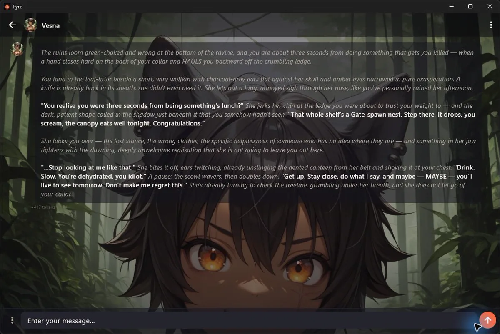
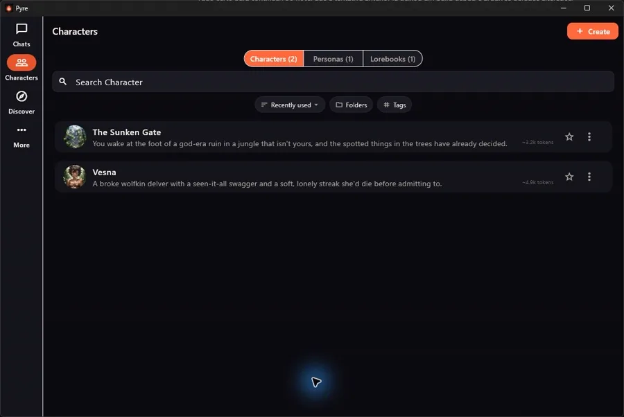
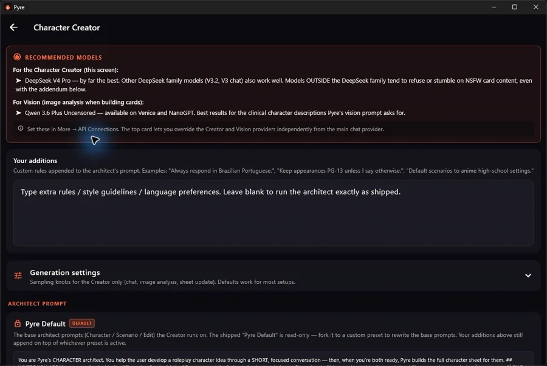
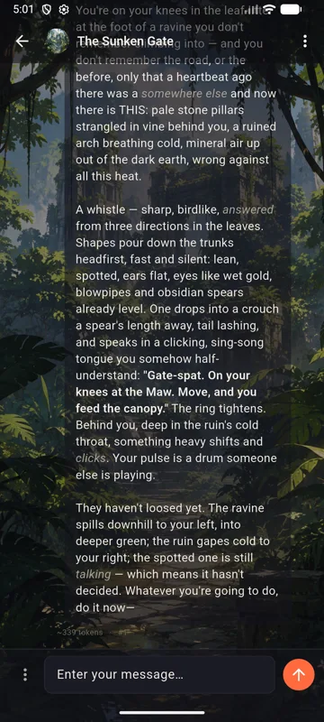
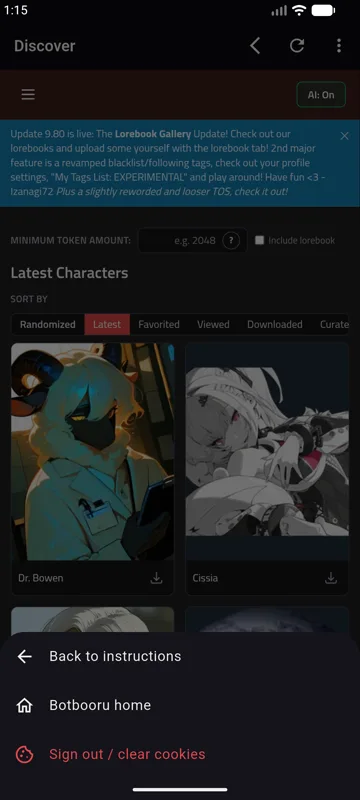

<div align="center">

# Pyre

### Private, local-first AI roleplay for characters, worlds, and long-running stories.

**Bring your own model. Keep your cards and chats on your devices. Pyre handles the roleplay layer around them.**

[Website](https://pyrechat.app) | [Download](https://github.com/devemberteam-ops/Pyre/releases/latest) | [Changelog](CHANGELOG.md) | [Privacy](docs/privacy-policy.md) | [Terms](docs/terms-of-service.md)

</div>

<p align="center">
  
</p>

<p align="center">
  
  
  
  
</p>

---

## What Pyre is

Pyre is a chat client for AI roleplay. You point it at whatever model provider you want -- OpenRouter, Venice, NanoGPT, Anthropic, a local server, anything OpenAI-compatible -- and Pyre handles the rest: characters, personas, group chats, branching, long-term memory, lorebooks, prompt presets, an AI-powered Creator, and a built-in window into the [BotBooru](https://botbooru.com) card community.

No account. No Pyre cloud chat database. No middle-man model proxy. Your data lives on your machine unless you choose to export, sync, or send prompts to a provider you configured.

It runs on **Android, Windows, Linux, and the web/PWA**, with a library that can move between phone and desktop through local backup, import/export, or your own paired hub.

## Why Pyre exists

We're roleplayers. For years the serious tooling meant one of two things: a powerful-but-punishing desktop app that was never designed for the phone -- where a lot of us actually read and write -- or a polished hosted site that owns your chats, owns your cards, and can change the rules whenever it wants.

Pyre is the middle path we wanted: a calm roleplay frontend that feels good on a phone, grows into a deeper desktop tool when you need it, and keeps your characters, worlds, and conversations under your control.

What that means in practice:

- **Mobile-first, not mobile-afterthought.** The interface is built for a thumb first, then widened for desktop.
- **Your model, your rules.** Pyre connects to providers and local servers; it does not host or moderate model output itself.
- **Your library stays yours.** Characters, chats, personas, lorebooks, presets, regex rules, settings, and Creator drafts live locally.
- **The card community is closer.** BotBooru / Discover can be browsed from inside Pyre where the platform supports safe embedding.
- **Clean for newcomers, deep for power users.** You can start with a character and a key, then dig into presets, lore, regex, checkpoints, and sync when you want the knobs.

## What Pyre does

Pyre is designed around roleplay mechanics instead of generic chatbot transcripts. You can:

- Import Tavern-style character cards or build new characters with the Creator.
- Chat one-on-one, in groups, or in Party Mode with a whole cast.
- Play as one persona or a roster of personas.
- Branch, retry, continue, edit, delete, and compare message variants.
- Use lorebooks, checkpoints, Live Sheet, Script direction, and prompt presets to keep long stories coherent.
- Browse and import cards/lorebooks from BotBooru and other supported sources.
- Export, back up, restore, and sync your library without handing it to a hosted Pyre account.

Core principles:

- **Bring your own key/provider.** Use OpenAI-compatible endpoints, Anthropic-native API on native apps, hosted providers, community proxies, or local servers.
- **Local-first library.** Characters, chats, personas, lorebooks, presets, regex rules, settings, and Creator drafts live on your device unless you export or sync them.
- **No Pyre cloud account.** There is no hosted Pyre chat database or central character library.
- **Mobile-first, desktop-capable.** Android is the primary mobile surface; desktop and web/PWA use wider layouts where useful.
- **Interoperable.** Pyre reads and writes Tavern-style cards and imports from the SillyTavern ecosystem.

## Current release

**Pyre 1.2 is the first non-beta release line.** The app is still moving quickly, but it has grown from an early public beta into a usable, local-first roleplay client with a broader feature set and active release work.

Pyre is open source under AGPL-3.0. It hosts no model, stores no cloud library, and does not moderate or proxy your content through an Ember Team server.

## New in 1.2

- **Group chats and Party Mode.** Chat with a cast one speaker at a time, or let the whole group answer as one narrated scene.
- **Persona party.** Your side can be a roster too: play as a duo or crew of personas in one chat.
- **Creator refresh.** Build or edit characters, scenarios, personas, and lorebooks through a structured Creator with review-before-save.
- **Surgical Edit with AI.** Edit specific fields or sections without rewriting the whole card.
- **Library references.** Attach existing characters, personas, or lorebooks as Creator references.
- **Checkpoints as chapters.** Long chats get branch-aware summary checkpoints that read like story chapters.
- **Live Sheet and Script.** Track current scene state and future story direction.
- **Lorebooks in the library.** World Info is treated like first-class library content.
- **Preset prefill and sampler passthrough.** More control over reply starts and provider sampling options.
- **Self-host and web hub improvements.** Browser clients can use a paired hub without storing API keys.
- **BotBooru Discover embed.** Browse trusted card/lorebook hubs inside Pyre where the platform supports safe embedding.

## Features

### Chat and roleplay

- Live token streaming, stop, retry, regenerate, continue, edit, delete, and copy.
- Message variants and non-destructive branching.
- Group chats, Party Mode, persona party, and per-message attribution snapshots.
- Alternate greetings and Fill-In opener for replaying scenes from a new starting beat.
- Slash commands for OOC, scene notes, system inserts, clear, help, and Script direction.
- Impersonate and Guide my message for drafting your next turn.
- Reasoning-model output handling with hidden-by-default `<think>` content.

### Characters and personas

- Full `chara_card_v2` import/export support.
- PNG card import/export, JSON card import, embedded lorebook handling, and opaque extension round-trip.
- Personas with avatars, descriptions, dialogue examples, and bound lorebooks.
- Convert any character into a persona with "Add as persona."
- Folders, tags, favorites, search, duplicate, mini-gallery, avatar recrop, and fullscreen avatar view.

### Creator

- Character architect, scenario architect, persona creator, and lorebook builder.
- Structured build passes with visible review before saving.
- Edit existing characters/personas/cards with AI and save in place or as copy.
- Attach library assets, card files, documents, and image references.
- Vision-provider routing for image references.
- Creator presets with locked defaults and editable forks.

### Lore, memory, and control

- Lorebooks / World Info with keywords, secondary keys, constant entries, probability, order, and scan diagnostics.
- Character-bound, persona-bound, chat-attached, and embedded lorebooks.
- Checkpoints, Live Sheet, and Script for long-scene continuity.
- Flat and modular prompt presets.
- Macros/template tokens, including `{{summary}}`.
- Regex find/replace rules with SillyTavern import support.

### Providers and reliability

- OpenAI-compatible endpoints and Anthropic-native direct calls on native apps.
- Localhost/LAN provider mode with warmer, more patient timeouts.
- Model browsing, connection testing, duplicate providers, and extra params.
- Smart fallback when a provider fails, returns empty text, or appears to refuse.
- Learned context limits and retry after context overflow.
- Local LLM debug log viewer for troubleshooting.

### Import, export, backup, and sync

- Import cards from file, URL, BotBooru, Chub/CharacterHub, RisuRealm, and direct `.png` / `.json` links.
- Import SillyTavern presets, lorebooks, regex rules, personas, and supported chats through a full ST backup `.zip`.
- Export characters/personas as Tavern-compatible PNGs.
- Export chats as SillyTavern JSONL or Pyre JSON archive.
- Full backup/restore with images embedded and keys excluded by default.
- LAN sync through a desktop or self-host hub.

## Platforms

| Feature area | Android | Windows | Linux | Web/PWA |
|---|:---:|:---:|:---:|:---:|
| Chat, characters, personas, presets, lorebooks, memory, Creator | Yes | Yes | Yes | Via hub |
| Group chat, Party Mode, persona party, Guide, regex rules | Yes | Yes | Yes | Yes |
| Direct BYOK provider setup | Yes | Yes | Yes | No, uses hub |
| Anthropic-native direct API | Yes | Yes | Yes | No |
| BotBooru / Discover | Embedded | WebView2 | External browser | Embedded via hub proxy |
| Generation keep-alive | Yes | No | No | No |
| Tray, shortcuts, window state, desktop toasts | No | Yes | Yes | No |
| LAN/web hub | No | Yes | Yes | No |
| Self-host server | No | Docker / Windows headless | Docker | Connects to it |
| Browser stores API keys | No | No | No | Never |

## Install

Download builds from the [latest release](https://github.com/devemberteam-ops/Pyre/releases/latest).

### Android

1. Download the Android APK.
2. Allow install from that source if Android asks.
3. Open Pyre and add a provider under **More -> API Connections**.

### Windows

1. Download the Windows zip and extract it.
2. Keep the folder together; the executable needs its sibling files.
3. Run `pyre.exe`.
4. If SmartScreen warns, choose **More info -> Run anyway** if you trust the build.

### Linux

Use the desktop build when available, or build from source. Discover may open in the external browser on Linux.

### Web / PWA

The web app is served by a desktop or self-host hub. Pair the browser with your hub; the browser does not store provider keys.

### Self-host hub

Pyre also has a headless hub/server path for users who want a trusted LAN/VPS hub. Keep public deployments behind your own TLS reverse proxy or private tunnel.

## Privacy

Pyre collects nothing by default.

- No account.
- No Pyre cloud chat database.
- No analytics, telemetry, ad IDs, or crash uploads.
- API keys live in OS-secure storage on native apps.
- Browser/PWA clients never store provider keys.
- Backups exclude keys unless you explicitly include the Connections category and confirm the warning.

What can leave the device: provider API calls you configure, sync traffic to devices/hubs you pair, browser traffic to your own hub, update checks, Discover browsing, and files you explicitly export/share.

## Build from source

Prerequisites: Flutter, the platform toolchain for your target, and Java/Android SDK for Android builds.

```bash
flutter pub get
flutter test
flutter run

flutter build apk --release
flutter build windows --release
flutter build linux --release
```

Release signing and packaging notes: [docs/RELEASE.md](docs/RELEASE.md).

## License

Pyre is licensed under AGPL-3.0. See [LICENSE](LICENSE).

Copyright (C) 2026 Ember Team.

---

<div align="center">

Built by Ember Team. Integrates with [BotBooru](https://botbooru.com) as a community source. Not affiliated with model providers; Pyre hosts no models and no content.

</div>
